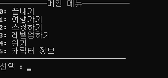
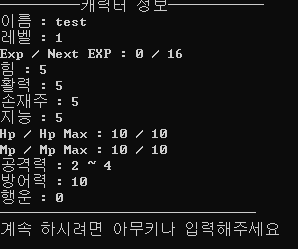
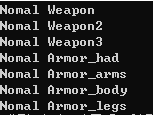
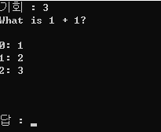
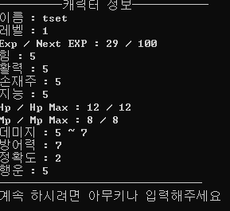
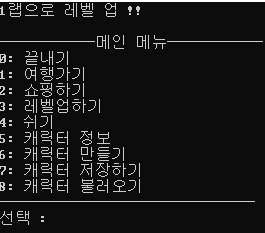
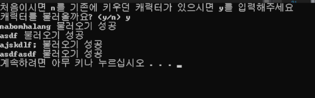
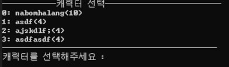

Text RPG
=============

+ [1일차](#10-31)
+ [2일차](#11-02)
+ [3일차](#11-15)

10-31
-------------

### Main menu


### Status print


+ 캐릭터 저장 character.txt파일 안에 정보 저장됨
+ 무기 및 갑옷 class 완성 Inventory class 생성후 .addItem()으로 생성 가능

### example


```c++
Inventory inven;
inven.addItem(Weapon(0, 0, "Nomal Weapon", 0, 0, 0, 0));
inven.addItem(Weapon(0, 0, "Nomal Weapon2", 0, 0));
inven.addItem(Weapon(0, 0, "Nomal Weapon3"));
inven.addItem(Armor(0, 0, "Nomal Armor_had", 0, 0, 0));
inven.addItem(Armor(0, 0, "Nomal Armor_arms", 0, 0));
inven.addItem(Armor(0, 0, "Nomal Armor_body", 0));
inven.addItem(Armor(0, 0, "Nomal Armor_legs"));

for (size_t i = 0; i < inven.size(); i++)
{
	cout << inven[i].item_debugPrint() << endl;
}
```


11-02
--------------
##### using namespace std; 삭제...

### Event 생성
#### Puzzle 생성

+ 경험치 알고리즘 : 레벨과 행운에 따라서 경험치가 올라간다.

```c++
iint gainExp = (rand() % (chances * character.getLevel() * character.getLuck())) + 5;
```



+ 퀴즈 세팅 파일은 같은 디렉토리 안 puzzle안에 존재한다.



+ 필요 경험치가 넘었을 경우 자동으로 다음 레벨로 넘어간다.

```c++
void Character::initialize(const std::string name)
{
	this->distanceTravelled = 0;

	this->name = name;
	this->level = 1;
	this->exp = 0;
	this->expNext = static_cast<int>((50 / 3) * ((pow(level, 3) - 6 * pow(level, 2) + 17 * level) - 12) + 100); //레벨 필요치 알고리즘
	
	this->gold = 1000;

	this->strength = 5;
	this->vitality = 5;
	this->dexterity = 5;
	this->intelligence = 5;
	
	this->hpMax = (this->vitality * 2) + (this->strength/2);
	this->hp = this->hpMax;
	this->mpMax = this->vitality + (this->strength / 2) + (this->dexterity/3);
	this->mp = this->mpMax;
	this->damageMin = this->strength;
	this->damageMax = this->strength + 2;
	this->defence = this->dexterity + (this->intelligence/2);
	this->accuracy = (this->dexterity / 2);
	this->luck = this->intelligence;

	this->statPoints = 0;
	this->skillPoints = 0;
}
```

+ 캐릭터 init 설정
+ 잘못된 입력 예외 처리
+ 캐릭터 저장 및 로드 기능 추가 (추가 : 로드 시 맨 처음 있는 캐릭터만 불러와짐 선택할 수 있도록 바꿔야할거 같음)

11-15
-------------
--간격이 너무 길어서 코드를 까먹어ㅠ--
#### 계정쪽으로 많은것들이 바뀌였습니다.

+ 이제 시작할때 캐릭터를 불러올 수 있습니다. 원하는 캐릭터 선택은 "캐릭터 선택하기"에 들어가서 선택하실 수 있습니다.
+ loading 기능을 완성 시켰습니다. 불러오기로 모든 캐릭터들을 vector에 넣어준 후 select하여 로그인합니다.
+ statPoint와 skillPoint를 정보창에서 보여주고 레벨업 칸에서 statPoints를 사용하여 기본 4가지의 힘중에 하나를 골라 올릴 수 있습니다.
+ dArray라는 자료구조 완성 : 적들(enemies)를 담기 위해 만들었다.

```c++
dArrary<int> ints;
	for (size_t i = 0; i < 5; i++)
	{
		ints.push(i*3);
		std::cout << ints[i] << std::endl;
	}
```


