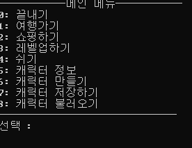

Text RPG
=============

[1일차](#10-31)


10-31
-------------

### Main menu


### Status print


+ 캐릭터 저장 character.txt파일 안에 정보 저장됨
+ 무기 및 갑옷 class 완성 Inventory class 생성후 .addItem()으로 생성 가능

### example


```c++
Inventory inven;
inven.addItem(Weapon(0, 0, "Nomal Weapon", 0, 0, 0, 0));
inven.addItem(Weapon(0, 0, "Nomal Weapon2", 0, 0));
inven.addItem(Weapon(0, 0, "Nomal Weapon3"));
inven.addItem(Armor(0, 0, "Nomal Armor_had", 0, 0, 0));
inven.addItem(Armor(0, 0, "Nomal Armor_arms", 0, 0));
inven.addItem(Armor(0, 0, "Nomal Armor_body", 0));
inven.addItem(Armor(0, 0, "Nomal Armor_legs"));

for (size_t i = 0; i < inven.size(); i++)
{
	cout << inven[i].item_debugPrint() << endl;
}
```


11-02
--------------
##### using namespace std; 삭제...

### Event 생성
#### Puzzle 생성
+ 경험치 알고리즘 : 레벨과 행운에 따라서 경험치가 올라간다.
```c++
int gainExp = rand() % (chances * character.getLevel() * ((rand()%character.getLuck())+1));
```


+ 퀴즈 세팅 파일은 같은 디렉토리 안 puzzle안에 존재한다.

+ 필요 경험치가 넘었을 경우 자동으로 다음 레벨로 넘어간다.